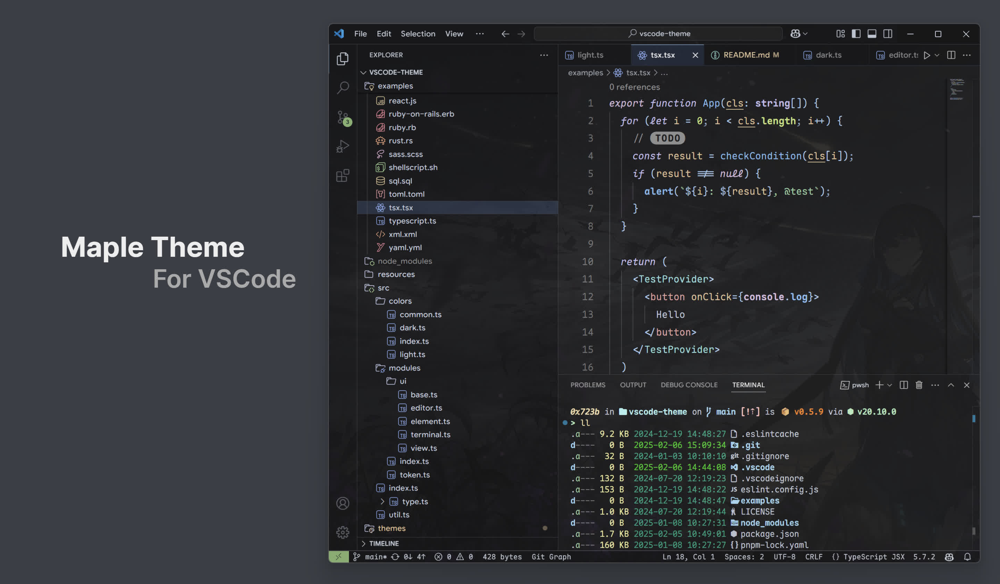

## Maple Dark Theme for VSCode

A colorful VSCode theme, support light or dark mode, with medium brightness and low saturation.




- Font: [Maple Mono](https://github.com/subframe7536/maple-font)
- Icon: [Catppuccin Icons for VSCode](https://github.com/catppuccin/vscode-icons)
- UI: [Custom UI Style](https://github.com/subframe7536/vscode-custom-ui-style)
- Terminal: PowerShell + [Starship](https://starship.rs/)

### Features

- Underline style function parameters
- Italic style keywords
- Different color on types
- Alternative color for some keywords, like `export` / `null` / `!important`

### Other IDE / Terminal (Dark Only)

#### JetBrains IDE Color Scheme

https://github.com/subframe7536/vscode-theme-maple/releases/latest

#### Windows Terminal

In `settings.json`

<!-- WT -->
```json
{
  "schemes": [
    {
      "name": "Maple Dark",
      "selectionBackground": "#cbd5e1",
      "cursorColor": "#cbd5e1",
      "background": "#1e1e1f",
      "foreground": "#cbd5e1",
      "brightBlack": "#666666",
      "brightBlue": "#a8e0ff",
      "brightCyan": "#bafffe",
      "brightGreen": "#bdf8c7",
      "brightPurple": "#ebe5ff",
      "brightRed": "#ffc4c4",
      "brightWhite": "#ffffff",
      "brightYellow": "#ffe8b9",
      "black": "#333333",
      "blue": "#8fc7ff",
      "cyan": "#a1e8e5",
      "green": "#a4dfae",
      "purple": "#d2ccff",
      "red": "#edabab",
      "white": "#f3f2f2",
      "yellow": "#eecfa0"
    }
  ]
}
```
<!-- WT -->

#### Ghostty

https://ghostty.org/docs/features/theme

<!-- GTTY -->
```
background = #1e1e1f
foreground = #cbd5e1
palette = 8=#666666
palette = 12=#a8e0ff
palette = 14=#bafffe
palette = 10=#bdf8c7
palette = 13=#ebe5ff
palette = 9=#ffc4c4
palette = 15=#ffffff
palette = 11=#ffe8b9
palette = 0=#333333
palette = 4=#8fc7ff
palette = 6=#a1e8e5
palette = 2=#a4dfae
palette = 5=#d2ccff
palette = 1=#edabab
palette = 7=#f3f2f2
palette = 3=#eecfa0
cursor-color = #cbd5e1
selection-background = #cbd5e1
selection-foreground = #1e1e1f
```
<!-- GTTY -->

### Italic Style On Keywords

If you just want the italic style on keywords like the theme do, just add this snippet into your `settings.json`

```jsonc
{
  // existing settings...
  "editor.semanticTokenColorCustomizations": {
    "rules": {
      "interface": {
        "italic": true
      },
      "selfParameter": {
        "italic": true
      },
      "keyword": {
        "italic": true
      },
      "*.static": {
        "italic": true
      }
    }
  },
  "editor.tokenColorCustomizations": {
    "textMateRules": [
      {
        "scope": [
          "constant.language.undefined",
          "constant.language.null",
          "constant.language.nullptr",
          "meta.type keyword.operator.expression.typeof",
          "meta.type keyword.operator.expression.keyof",
          "keyword.control",
          "keyword.function",
          "keyword.operator.new",
          "keyword.operator.borrow.and.rust",
          "storage.type",
          "storage.modifier",
          "variable.language.this",
          "markup.italic"
        ],
        "settings": {
          "fontStyle": "italic"
        }
      }
    ]
  }
}
```

## Credit

- Design inspiration: [moegi](https://github.com/moegi-design/vscode-theme)
- Project structure: [vitesse](https://github.com/antfu/vscode-theme-vitesse)
- Type check: [dracula](https://github.com/dracula/visual-studio-code)

## License
MIT
