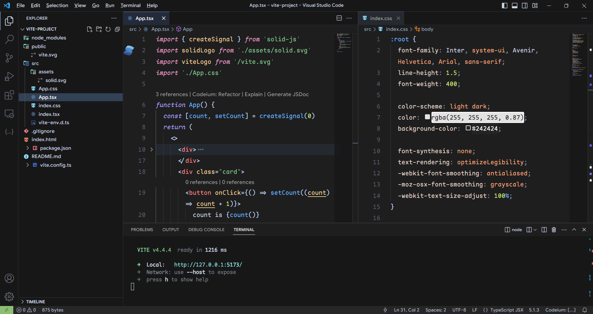

## Maple Dark Theme for VSCode

a colorful theme in dark, with medium level contrast

- font: [Maple Mono](https://github.com/subframe7536/maple-font)

## credit

- design inspiration: [moegi](https://github.com/moegi-design/vscode-theme)
- project structure: [vitesse](https://github.com/antfu/vscode-theme-vitesse)
- type check: [dracula](https://github.com/dracula/visual-studio-code)

## License
MIT